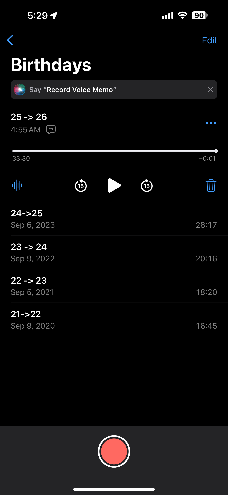

# A Podcast To Your Future Self

An annual tradition that highlights my twenties

<!--truncate-->

It's a small tradition of mine, but every year on my birthday, I record a podcast for my future self. I recap the year that just passed—the highs and the lows. I hear the excitement in my voice when I talk about the highlights, and I notice my tone drop as I recount the setbacks. Nothing is off-limits. I allow myself to be as vulnerable as I choose. This is a podcast made exclusively for me.

I started this the night before I turned 22. On the 9th, as I was getting ready for bed, I set my phone on the nightstand and pressed the record button. I had no expectations, no pre-written script—maybe just a few notes about things I wanted to mention. I just talked. I highlighted everything.

Now, at 26, I listen back and hear how much I've changed throughout my twenties. I cringe at awkward moments, smile when something amazing comes up, and listen closely to the tough times, reminding myself that I made it through.

Maybe it’s something you could try.

